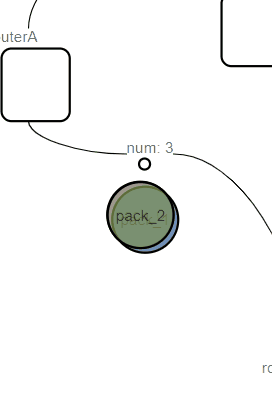

# 小组附加题11：无连接服务的实现

## 使用说明：

### 1.操作输入限制

输入范围为1-6 分别对应于下图的A-F号路由；

出现以下清空不可删除结点：

> - 结点是头尾结点；
> - 结点相邻边包含数据包；

发送包：（需要修改）

### 2.动画效果演示图

有三中元素构成：

- 路由

  拥有一张路由表，决定了下一个进入路由后的出口，下图中为**白色矩形**；

  `hover`状态下会出现相应的提示，每一行的含义是当出现`标号`的目的地时，会通向的下一个路由；

  

- 包结点

  为两个路由的连接结点，所有的数据包会在此停留...下图中为**白色小圆点**...

  上方的数字含义为此时在这条边上的包数；

  `hover`状态下会出现相应的提示，每一行的含义是，当前第几号包，上一时刻来自哪个路由

  

- 数据包

  为某一个数据包，其后的数字，代表其数据包的编号（每一个数据包的id都不同，且从0开始；如果第一次发送了三个数据包，那么这三个的数据包的id分别为0、1、2）

  

注意：以上所有元素都可以拖动~

### 3.两张表含义解释

#### 路由表

记录了每一个路由此时的信息（?为无效...要么就是发给自己，要么就是已经被删除了...)

按列来看，每行的意思为`此时来了一个数据包，他的目的地是D，那么他的下一个出口需要到B`！

#### 数据包表

记录当前每个数据包（这里只记录了未到达目的地的数据包）的位置信息。

每一行为一个数据包的信息；

第一列，✔代表显示，如果你不希望多余的数据包干扰你的观察，请只✔你需要的包；

第二列，当前数据包的id号，对应图上的圈里的数字；

第三列，当前数据包已经流动的路径；

